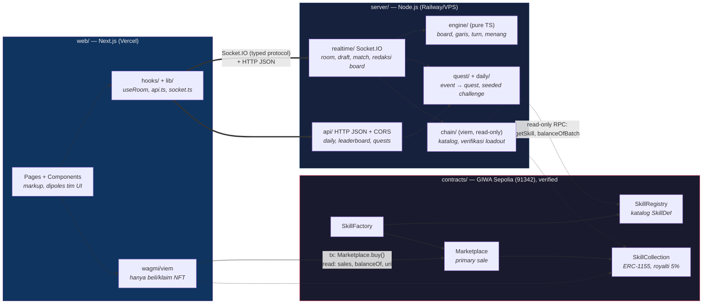

# TheBingoFi

Bingo strategis multiplayer, free-to-play, non-gambling. Gameplay 100% web2 (nol transaksi saat main); monetisasi lewat Skill & Skin NFT di GIWA (OP Stack L2). Konsep lengkap: [CONCEPT.md](CONCEPT.md).

## Arsitektur: Smart Contract ↔ BE ↔ FE

Prinsip: **on-chain = ownership & katalog; off-chain = seluruh gameplay.** Server authoritative, client tidak dipercaya. FE cuma menyentuh chain untuk beli/lihat NFT; server cuma **membaca** chain (tidak pernah menulis saat match).



Kontrak antar layer dijaga compiler, bukan dokumen:

- **FE ↔ BE**: FE import tipe dari `@thebingofi/server/protocol` (event Socket.IO + response HTTP) dan `@thebingofi/server/engine` (validasi board yang sama dengan server). Server di-compile pakai tipe yang sama → drift = build error.
- **BE/FE ↔ SC**: ABI di `contracts/abi/*.json`, address di `contracts/deployments/91342.json` — dua-duanya generated dari source, bukan tulis tangan.
- **Alur beli** (satu-satunya jalur token tercetak): FE `buy()` + ETH → Marketplace mint via Collection → event `Purchased`/`TransferSingle` → server refresh entitlement → skill kepakai di loadout. Detail per kontrak + sequence diagram: [contracts/README.md](contracts/README.md).

## Kontrak Live — GIWA Sepolia (chain 91342, semua verified)

| Kontrak | Address |
|---|---|
| SkillRegistry | [`0xEb1d19B0d95b73Ef1A6e00B2D83f8F69999e2BD4`](https://sepolia-explorer.giwa.io/address/0xEb1d19B0d95b73Ef1A6e00B2D83f8F69999e2BD4) |
| SkillFactory | [`0xa9F2f90b5275e217a8b76049fFF4A0c6EC8Ead0D`](https://sepolia-explorer.giwa.io/address/0xa9F2f90b5275e217a8b76049fFF4A0c6EC8Ead0D) |
| SkillCollection | [`0x1204602e50af5d714Fc1A8c6d7EbFa01bEEC3B10`](https://sepolia-explorer.giwa.io/address/0x1204602e50af5d714Fc1A8c6d7EbFa01bEEC3B10) |
| Marketplace | [`0x127b3d2F1b15720BAF6Df299b4e5E7f50c785c9d`](https://sepolia-explorer.giwa.io/address/0x127b3d2F1b15720BAF6Df299b4e5E7f50c785c9d) |

Katalog sudah berisi 5 skill awal (id 1–5: Wild Daub, Double Call, Ghost Call, Cell Swap, Nullify). Machine-readable: `contracts/deployments/91342.json`.

## Struktur

```
contracts/   Solidity (Foundry) — Registry, Factory, Collection (ERC-1155), Marketplace
server/      Backend (Node.js + TS) — engine pure, realtime Socket.IO, HTTP API, chain reader
web/         Web client (Next.js + TS + Tailwind) — kerangka fungsional, styling oleh tim UI
```

## Setup & Jalanin

```bash
pnpm install                                  # server + web (pnpm workspaces)
pnpm --filter @thebingofi/server dev          # realtime + HTTP API di :3001
pnpm --filter @thebingofi/web dev             # Next.js di :3000
```

## Test

```bash
pnpm test:contracts   # forge test (34 test, coverage 100%)
pnpm test:server      # node --test (94 test: engine, daily, quest, realtime, http, chain)
```

## API untuk FE

- `server/API.md` — kontrak lengkap: event Socket.IO (typed, import dari `@thebingofi/server/protocol`) + HTTP API (daily challenge, leaderboard, quests).
- `contracts/abi/*.json` + `contracts/deployments/91342.json` — ABI & address untuk wagmi/viem (lihat `contracts/README.md`).

## Deploy Kontrak (GIWA Sepolia)

Salin `.env.example` → `.env`, isi `PRIVATE_KEY` (jangan pernah commit), lalu:

```bash
cd contracts
forge script script/Deploy.s.sol --rpc-url giwa_sepolia --broadcast \
  --verify --verifier blockscout --verifier-url https://sepolia-explorer.giwa.io/api
```
