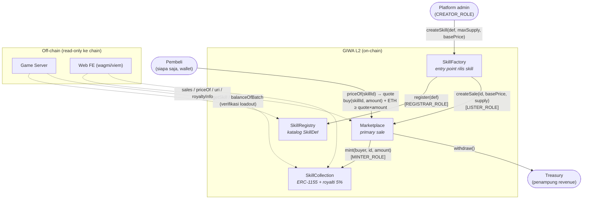
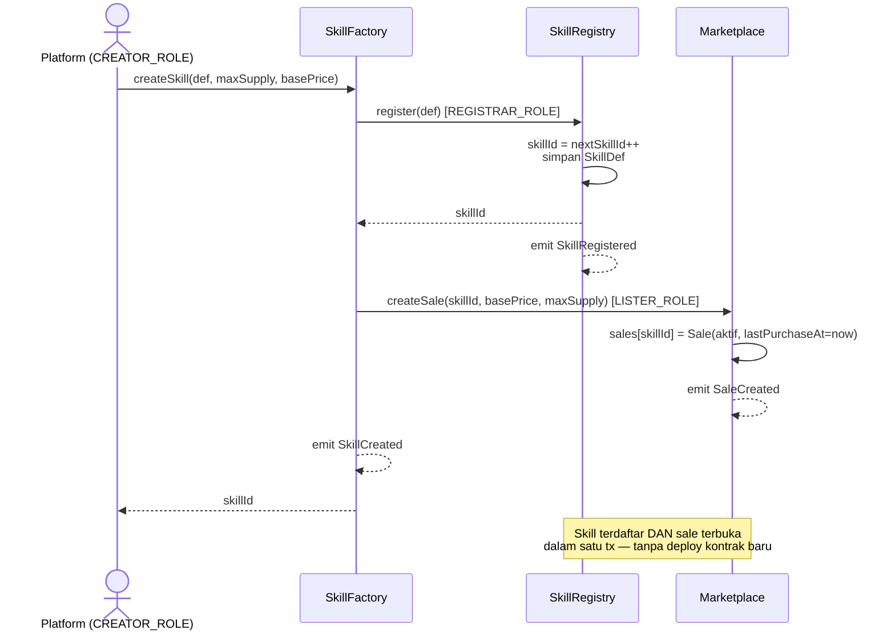
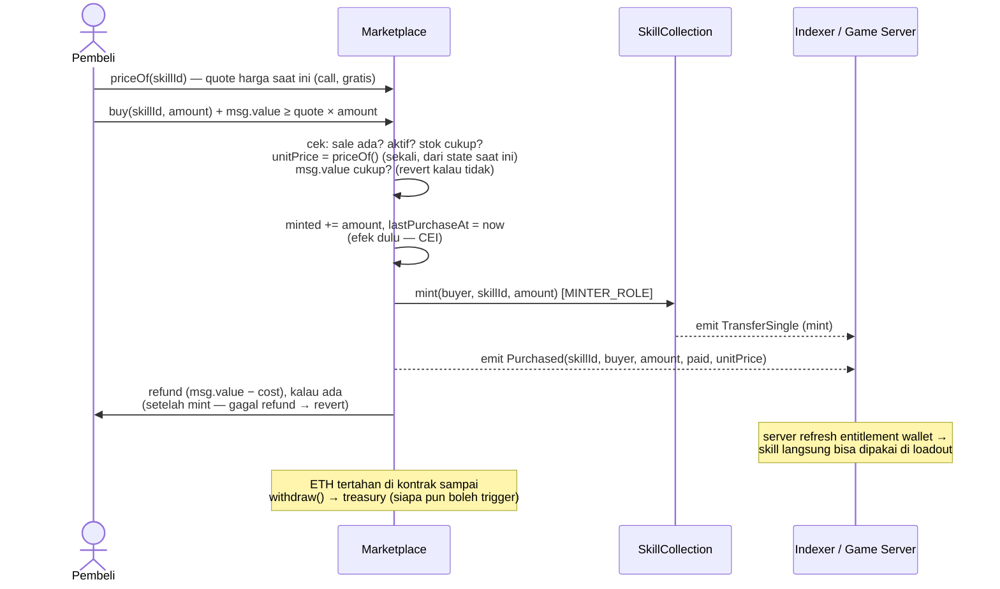

# contracts/ — TheBingoFi

Kontrak Solidity (Foundry) untuk **ownership & katalog** Skill/Skin NFT
TheBingoFi. Sesuai prinsip arsitektur di root `CLAUDE.md`: **on-chain = ownership
& katalog; off-chain = seluruh gameplay**. Tidak ada mekanik taruhan/pot/stake
apa pun di sini — hanya primary sale NFT.

## Peta Arsitektur & Interaksi

Siapa boleh manggil apa, dan ke mana alurnya:



Garis putus-putus = **read-only** (tidak pernah ada tx dari server/FE saat gameplay).
Setiap panah penuh dijaga role — tidak ada jalur lain: satu-satunya cara token
tercetak adalah pembelian lewat Marketplace, dan satu-satunya cara skill masuk
katalog adalah `createSkill` di Factory.

### Alur rilis skill baru (platform, 1 transaksi)



### Alur pembelian (user)



## Ringkasan 4 Kontrak

| Kontrak | Peran |
|---|---|
| **SkillRegistry** | Katalog `SkillDef` (skillId, effectType, charges, cooldown, maxPerLoadout, rarity, active, metadataURI). `effectType` (bytes32, mis. `"WILD_DAUB"`) hanyalah identifier — **tidak dieksekusi on-chain**, di-mapping ke logic di game server. Hanya `REGISTRAR_ROLE` (dipegang SkillFactory) yang boleh `register()`. |
| **SkillFactory** | Entry point tunggal platform (`CREATOR_ROLE`) untuk merilis skill baru: `createSkill(SkillDef, maxSupply, price)` sekali panggil mendaftarkan ke Registry **dan** langsung membuka sale di Marketplace. Tidak ada deploy kontrak baru per skill. |
| **SkillCollection** | Satu ERC-1155 untuk seluruh Skill & Skin. `tokenId == skillId` dari SkillRegistry. Mint hanya lewat `MINTER_ROLE` (dipegang Marketplace). Mengimplementasikan **EIP-2981** royalti default 5% (500 basis points). |
| **Marketplace** | Primary sale dengan **dynamic pricing** — `buy(skillId, amount)` payable, mint langsung ke pembeli, checks-effects-interactions, kelebihan bayar auto-refund. Revenue mengalir ke `treasury` platform via `withdraw()`. |

Wiring role (dari `script/Deploy.s.sol`):
- `SkillFactory` → `REGISTRAR_ROLE` di SkillRegistry & `LISTER_ROLE` di Marketplace.
- `Marketplace` → `MINTER_ROLE` di SkillCollection.

## Dynamic Pricing (Marketplace v2)

Implementasi on-chain dari model ekonomi di `CONCEPT.md` §4: harga primary
sale bukan angka statis, tapi **scarcity ramp + demand decay** yang dihitung
tiap saat dari `Marketplace.priceOf(skillId)`.

- **Scarcity ramp** — makin dekat sold-out, makin mahal (linear sampai
  `scarcityBps` di `minted == maxSupply`, default `10000` = **+100%**):

  ```
  scarcityPremium = basePrice * scarcityBps * minted / maxSupply / 10000
  ```

- **Demand decay** — tiap `decayInterval` penuh (default `1 days`) tanpa
  pembelian menambah `decayStepBps` diskon (default `500` = 5%), dibatasi
  `maxDiscountBps` (default `5000` = 50%). Diskon **reset ke 0** begitu ada
  pembelian baru (`lastPurchaseAt` di-update):

  ```
  discountBps = min(maxDiscountBps, (block.timestamp - lastPurchaseAt) / decayInterval * decayStepBps)
  ```

- **Harga unit final**:

  ```
  priceOf(skillId) = (basePrice + scarcityPremium) * (10000 - discountBps) / 10000
  ```

- Parameter di atas (`scarcityBps`, `decayInterval`, `decayStepBps`,
  `maxDiscountBps`) adalah **satu set global** untuk semua sale, disimpan di
  `Marketplace.pricingParams()` dan di-tuning kapan saja lewat
  `setPricingParams(...)` (`DEFAULT_ADMIN_ROLE`) — **tanpa redeploy kontrak**.
- `buy(skillId, amount)` menghitung `unitPrice` **sekali** dari state saat tx
  dieksekusi (bukan naik di tengah pembelian multi-unit), lalu
  `cost = unitPrice * amount`. `msg.value` harus `>= cost` (kurang → revert
  `InsufficientPayment(cost, msg.value)`); kelebihan di-refund ke pembeli
  **setelah** mint (CEI) — kalau refund gagal (mis. pembeli kontrak tanpa
  `receive`), seluruh tx revert `RefundFailed` (dana pembeli aman, tidak ada
  state yang nyangkut setengah).
- `priceOf(skillId)` tetap bisa di-query walau sale sudah sold-out (berguna
  untuk UI "harga terakhir" / referensi); yang revert kalau sold-out hanya
  `buy()` (`SoldOut`).

## Fungsi yang Dipanggil Frontend (wagmi/viem)

- **Quote harga (WAJIB sebelum beli)**: `Marketplace.priceOf(skillId)` — view,
  mengembalikan harga unit **saat ini** (sudah termasuk scarcity premium +
  demand-decay discount, lihat bagian Dynamic Pricing di bawah). **FE HARUS
  quote lewat `priceOf`, jangan pernah hitung harga manual dari
  `basePrice`** — harga berubah setiap ada pembelian (minted naik) dan
  setiap saat karena decay (waktu berjalan), jadi nilai `basePrice` di
  `sales(skillId)` saja tidak cukup untuk menampilkan harga beli yang benar.
- **Beli skill/skin**: `Marketplace.buy(skillId, amount)` — `payable`,
  kirim `msg.value = priceOf(skillId) * amount` (quote dulu lewat `priceOf`
  tepat sebelum submit tx untuk minimalkan selisih akibat harga bergerak).
  `msg.value` boleh lebih besar dari cost aktual (harga dihitung sekali dari
  state saat tx dieksekusi) — **kelebihan otomatis di-refund** ke pembeli
  dalam transaksi yang sama, jadi FE bisa kirim quote + small buffer untuk
  jaga-jaga tanpa takut dana nyangkut. `msg.value` yang kurang dari cost akan
  revert `InsufficientPayment(expected, actual)`.
- **Cek kepemilikan**: `SkillCollection.balanceOf(owner, skillId)` — dipakai
  server saat matchmaking untuk verifikasi loadout, dan FE untuk tampilkan
  inventory.
- **Metadata token**: `SkillCollection.uri(skillId)` (ERC-1155 standard, base
  URI dengan placeholder `{id}`).
- **Katalog skill**: `SkillRegistry.getSkill(skillId)` — ambil `SkillDef`
  lengkap untuk render kartu skill di FE (nama/efek di-resolve dari
  `metadataURI`, aturan main dari `charges`/`cooldown`/`maxPerLoadout`).
- **Royalti (marketplace sekunder pihak ketiga)**:
  `SkillCollection.royaltyInfo(tokenId, salePrice)` (EIP-2981) → mengembalikan
  `(receiver, 5% dari salePrice)`.

## Events untuk Indexer / Server

| Event | Kontrak | Kegunaan |
|---|---|---|
| `SkillCreated(skillId, effectType, maxSupply, price)` | SkillFactory | Skill baru dirilis — server sync katalog & mapping `effectType` ke logic engine. |
| `SkillRegistered(skillId, effectType)` | SkillRegistry | Redundan dengan `SkillCreated` tapi berguna kalau ada jalur registrasi lain. |
| `SaleCreated(skillId, basePrice, maxSupply)` / `SaleActiveSet(skillId, active)` | Marketplace | Status sale untuk katalog toko FE. |
| `Purchased(skillId, buyer, amount, paid, unitPrice)` | Marketplace | Trigger utama indexer — user beli skill, server refresh entitlement wallet tsb. `unitPrice` = harga per unit saat tx (untuk histori harga/analytics), `paid` = total cost aktual (net, di luar refund). |
| `PricingParamsUpdated(scarcityBps, decayInterval, decayStepBps, maxDiscountBps)` | Marketplace | Admin tuning parameter dynamic pricing global — FE bisa refresh kalkulasi/kurva harga yang ditampilkan. |
| `TransferSingle(operator, from, to, id, value)` / `TransferBatch(...)` | SkillCollection (ERC-1155 standard) | Transfer/mint/burn token — dasar indexer inventory & ownership real-time (termasuk transfer di marketplace sekunder). |

## Live di GIWA Sepolia (chain 91342) — deployed & verified

| Kontrak | Address |
|---|---|
| SkillRegistry | [`0x453Ea80704A0d28c6a174c2eDACf49762813f308`](https://sepolia-explorer.giwa.io/address/0x453Ea80704A0d28c6a174c2eDACf49762813f308) |
| SkillFactory | [`0x1923eBbDd522c7FAd8BfCD8741372bff62109871`](https://sepolia-explorer.giwa.io/address/0x1923eBbDd522c7FAd8BfCD8741372bff62109871) |
| SkillCollection | [`0x58ABFFcA5C517f93B0116b5b1b1b6AF914148077`](https://sepolia-explorer.giwa.io/address/0x58ABFFcA5C517f93B0116b5b1b1b6AF914148077) |
| Marketplace | [`0xb3f468350c16906AA4E201CE4f7D464e0fb46D48`](https://sepolia-explorer.giwa.io/address/0xb3f468350c16906AA4E201CE4f7D464e0fb46D48) |

Semua ter-verify di Blockscout (redeploy — Marketplace v2 dynamic pricing,
2026-07-30). Katalog sudah di-seed 5 skill awal lewat `script/SeedSkills.s.sol`
dengan **supply & basePrice bertingkat** untuk mendemokan scarcity tier dari
dynamic pricing (lihat bagian Dynamic Pricing di atas):

| id | Skill | maxSupply | basePrice |
|---|---|---|---|
| 1 | WILD_DAUB | 1000 | 0.0005 ETH |
| 2 | DOUBLE_CALL | 500 | 0.0008 ETH |
| 3 | GHOST_CALL | 250 | 0.001 ETH |
| 4 | CELL_SWAP | 100 | 0.002 ETH |
| 5 | NULLIFY | 10 | 0.01 ETH (super rare) |

Supply makin kecil → basePrice makin tinggi sejak rilis, dan makin cepat
mencapai premium scarcity penuh (+100%) karena `minted/maxSupply` naik lebih
cepat per unit terjual. Address juga tersedia machine-readable di
`deployments/91342.json`.

## Deploy ke GIWA Sepolia

1. Copy env: dari root repo, isi `.env` berdasar `.env.example` (`PRIVATE_KEY`,
   `TREASURY_ADDRESS` opsional — default ke address deployer, `COLLECTION_URI`
   opsional).
2. Dari folder `contracts/`:

   ```bash
   forge script script/Deploy.s.sol --rpc-url giwa_sepolia --broadcast \
     --verify --verifier blockscout --verifier-url https://sepolia-explorer.giwa.io/api
   ```

   (`giwa_sepolia` sudah didefinisikan di `foundry.toml` → `https://sepolia-rpc.giwa.io/`,
   rate-limited, jangan untuk production traffic tinggi.)

   **Verifikasi**: GIWA Sepolia (chain 91342) belum terdaftar di Etherscan API v2
   (cek `https://api.etherscan.io/v2/chainlist`), explorer-nya adalah **Blockscout**
   — jadi verify lewat Blockscout API seperti flag di atas, tanpa API key. Kalau
   deploy sudah terlanjur tanpa `--verify`, susulkan per kontrak dengan
   `forge verify-contract <address> <Contract> --verifier blockscout --verifier-url
   https://sepolia-explorer.giwa.io/api --chain 91342`.

3. Setelah broadcast sukses, script otomatis menulis
   `deployments/91342.json` (chain ID GIWA Sepolia) berisi address ke-4
   kontrak — lihat `deployments/README.md`.
4. Verifikasi kontrak di explorer (opsional): `https://sepolia-explorer.giwa.io`.

Jangan pernah commit private key. `.env` sudah ada di `.gitignore` root.

## Regenerate ABI untuk FE/Server

```bash
cd contracts
./export-abi.sh
```

Menjalankan `forge inspect <Contract> abi --json` untuk keempat kontrak dan
menulis **ABI array murni** (bukan artifact Foundry penuh) ke
`abi/SkillRegistry.json`, `abi/SkillFactory.json`, `abi/SkillCollection.json`,
`abi/Marketplace.json`. File-file ini yang di-import langsung oleh `web/`
(wagmi/viem `getContract({ abi, address })`) dan `server/`. Jalankan ulang
setiap kali signature fungsi/event di `src/` berubah.

## Lokasi Address Hasil Deploy

`deployments/<chainId>.json` — ditulis otomatis oleh `script/Deploy.s.sol`
setiap `--broadcast`. FE dan server baca address kontrak dari file ini
(gabungkan dengan ABI dari `abi/`), jangan hardcode address di kode aplikasi.
Detail format ada di `deployments/README.md`.

## Development

```bash
forge build   # compile
forge test    # unit test (52 test, wajib hijau semua sebelum ubah src/)
forge coverage --no-match-coverage script   # coverage (wajib 100% semua kolom)
forge fmt     # format
```

Test wajib mencakup: win-independent unit test tiap kontrak (Registry role
guard, Factory wiring, Collection mint/royalti, Marketplace buy/sale
lifecycle + dynamic pricing: scarcity ramp, demand decay, refund, validasi
`setPricingParams`). Jangan ubah logic di `src/` tanpa memastikan `forge
test` tetap hijau dan coverage tetap 100%.
