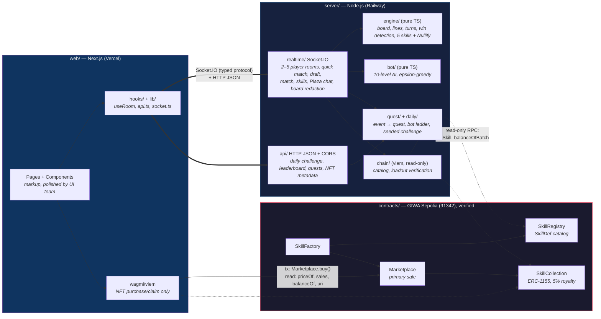

## Core principle

> **On-chain = ownership & catalog. Off-chain = all gameplay.**

The smart contracts only ever answer two questions: *what skills/skins exist* (the catalog) and *who owns which ones* (ownership). Everything about actually playing a match — turn order, calling numbers, validating a drafted board, executing skill effects, detecting a win — happens on the game server, and the game server only ever **reads** the chain; it never writes to it during a match.

## System diagram

The boundary between layers is enforced by the compiler, not just documentation:

- **Frontend ↔ Server**: the web client imports its types directly from `@thebingofi/server/protocol` (Socket.IO events + HTTP response shapes) and `@thebingofi/server/engine` (the same board validation logic the server runs) — the server is compiled against the same types, so any drift is a build error, not a runtime surprise.
- **Backend/Frontend ↔ Contracts**: ABIs live in `contracts/abi/*.json`, addresses in `contracts/deployments/91342.json` — both generated from the contract source, never hand-written.
- **The only path that ever mints a token**: frontend calls `Marketplace.buy()` with ETH → the Marketplace mints via `SkillCollection` → a `Purchased`/`TransferSingle` event fires → the server refreshes that wallet's entitlement → the skill becomes usable in a loadout. See [Smart Contracts](/smart-contracts) for the full sequence.

## Server authoritative, client untrusted

Every rule of the game is re-validated server-side: whose turn it is, whether a called number was already called, whether a submitted board is a valid 5×5 permutation of 1–25, whether a skill use is legal (right turn, charge remaining, valid target cell), and win detection. The client never gets to assert any of this on its own.

### Board redaction (anti-cheat)

`MatchView` — the payload broadcast to clients during a match — is built **per-socket**, not once per room, specifically so that a viewer only ever receives their own board:

- `board` in `MatchView` contains only the viewer's own board. An opponent's board is never present in any payload, for any player, at any point in the match.
- The same redaction applies to `loadout`, `daubedCells` (Wild Daub targets), and `ghostNumbers` (Ghost Call targets) — each is scoped strictly to the viewer.
- `pendingSkill` (which skill is awaiting a Nullify decision, and from whom) is public to the room, but deliberately omits the skill's `args` (e.g. which cell a Wild Daub targeted) — enough to render "opponent used X, respond?" without leaking board contents.
- A bot's board follows the exact same redaction rules as a human's — to the engine, a bot is just another `MatchPlayer`, so there's no special-cased leak path.

## Identity & persistence

### Stable account identity

`identity:hello` gives every player a stable `accountId` that survives across matches, rooms, and reconnects, as long as the client retains the opaque `token` it's issued (the server stores only a hash of that token, never the plaintext, after the initial handshake). This is distinct from the ephemeral, per-room seat ID used for turn order — a client tracks both, for different purposes. A player who never calls `identity:hello` still gets a real (but ephemeral, non-resumable) account created automatically the first time one is needed.

### Postgres persistence (optional)

<Tabs>
  <Tab title="Persisted (with DATABASE_URL)">
    - Player accounts, including linked wallet (`players` table)
    - Quest progress (`quest_progress`)
    - Daily Challenge scores (`daily_scores`)
    - Plaza chat history (`plaza_messages`)
  </Tab>
  <Tab title="In-memory only, always">
    - Rooms and matches currently in progress — intentional: a match lasts minutes and is tied to a live socket connection, so there is no meaningful "resume a room" story after a server restart; every client already has to reconnect and re-authenticate from scratch.
    - Plaza rate-limit state (per socket).
    - Wallet-link nonces (~5 minute lifetime).
  </Tab>
</Tabs>

`DATABASE_URL` is entirely optional — without it, the server runs fully functional in an in-memory mode (this is also what local development and the test suite use by default). With it, a single dependency (`pg`, no ORM) connects to Postgres and four store implementations switch from in-memory to SQL-backed automatically.

## Chain reader (read-only)

A thin, dependency-injected layer (`server/src/chain/`) is the only part of the server that ever talks to GIWA Sepolia, and it only ever reads:

- **Catalog reads** — `SkillRegistry.getSkill`/`nextSkillId` back the `GET /metadata/:id.json` endpoint and loadout resolution.
- **Ownership reads** — `SkillCollection.balanceOfBatch` backs `verifyLoadout`, called whenever a player sets a loadout in a `standard`-mode room (own wallet + `active` flag + `maxPerLoadout`, all checked against live chain state — not a cached indexer).
- **Address resolution** — contract addresses are resolved in order: explicit `REGISTRY_ADDRESS`/`COLLECTION_ADDRESS` env vars, then a fallback read of `contracts/deployments/91342.json`, then "not configured." Because the contracts are already live on Sepolia and checked into `contracts/deployments/91342.json`, `standard` mode and the metadata endpoint work out of the box on a fresh checkout with no environment configuration at all.

<Note>
  There is currently **no chain indexer/event listener**. The server does live, per-request reads instead (e.g. a fresh `balanceOfBatch` call every time a loadout is set) — entitlements are always accurate, at the cost of an RPC round-trip instead of a cached index. See [Smart Contracts](/smart-contracts#events) for what the event table would back if an indexer is added later.
</Note>
