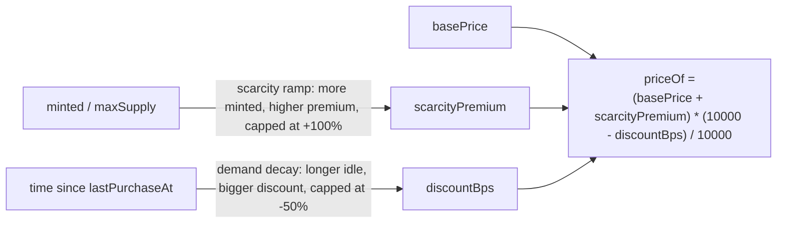

TheBingoFi's entire business model is the sale of Skill and Skin NFTs. There is no other revenue mechanism, and, as covered in [Solution](/solution), no stake, pot, pool, or token anywhere in the product.

## Revenue sources

<CardGroup cols={2}>
  <Card title="Primary sale" icon="cart-shopping">
    Players buy skills/skins directly from the platform through `Marketplace.buy()`, which mints the NFT straight to the buyer. Price is set by the on-chain dynamic pricing model below, not a fixed number.
  </Card>
  <Card title="Secondary royalty" icon="rotate">
    Any resale on a third-party NFT marketplace pays a **5% royalty** (500 basis points) back to the platform, via the `SkillCollection` contract's EIP-2981 default royalty.
  </Card>
</CardGroup>

<Frame caption="The in-app marketplace, quoting live priceOf() for each skill.">
  
</Frame>

## Dynamic pricing: scarcity ramp + demand decay

Primary sale price is **not a static number**. It's computed on-chain, on every call, from two forces pulling in opposite directions: the closer a skill gets to selling out, the more expensive it gets; the longer a skill goes without a sale, the cheaper it gets. This is implemented in `Marketplace.sol` and is live on GIWA Sepolia today.



### Scarcity ramp

As more units of a skill are minted, its price ramps up linearly, reaching the maximum premium exactly when the sale is fully sold out:

```
scarcityPremium = basePrice * scarcityBps * minted / maxSupply / 10000
```

With the default global parameter `scarcityBps = 10000`, that means **up to +100% over `basePrice`** once `minted == maxSupply`.

### Demand decay

If a skill goes untouched, its price steps down over time, capped at a maximum discount, and reset to zero the instant someone buys:

```
discountBps = min(maxDiscountBps, (block.timestamp - lastPurchaseAt) / decayInterval * decayStepBps)
```

Default parameters: `decayInterval = 1 day`, `decayStepBps = 500` (5% per full day of inactivity), `maxDiscountBps = 5000` (50% ceiling). Every purchase resets `lastPurchaseAt`, which resets the discount to 0.

### Final unit price

```
priceOf(skillId) = (basePrice + scarcityPremium) * (10000 - discountBps) / 10000
```

`Marketplace.priceOf(skillId)` is the **only** correct source for a purchase quote: `basePrice` alone is never enough, since real price moves with every mint and with elapsed time. `buy(skillId, amount)` computes `unitPrice` once from state at execution time (not re-priced mid-multi-unit-purchase), and any `msg.value` overpayment is automatically refunded in the same transaction (checks-effects-interactions; if the refund itself fails, the whole transaction reverts, so buyer funds are never stranded).

All four parameters above (`scarcityBps`, `decayInterval`, `decayStepBps`, `maxDiscountBps`) are one global set, tunable at any time via `setPricingParams(...)` (admin-only). **No redeploy required.**

<Note>
  These are the contract's shipped default values. They're a single global set applied to every sale and can be retuned by the platform at any time.
</Note>

### Worked examples (default parameters)

<Tabs>
  <Tab title="Scarcity: Wild Daub (id 1)">
    `basePrice = 0.0005 ETH`, `maxSupply = 1000`

    | Minted | Scarcity premium | `priceOf` |
    |---|---|---|
    | 0 (fresh) | +0% | 0.0005 ETH |
    | 500 (50% sold) | +50% | 0.00075 ETH |
    | 1000 (sold out) | +100% | 0.001 ETH |
  </Tab>
  <Tab title="Scarcity: Nullify (id 5, super rare)">
    `basePrice = 0.01 ETH`, `maxSupply = 10`

    | Minted | Scarcity premium | `priceOf` |
    |---|---|---|
    | 0 (fresh) | +0% | 0.01 ETH |
    | 9 (90% sold) | +90% | 0.019 ETH |
    | 10 (sold out) | +100% | 0.02 ETH |

    Because `minted / maxSupply` moves in much bigger steps when `maxSupply` is only 10, a low-supply skill like Nullify reaches full scarcity premium far faster, unit for unit, than a high-supply skill like Wild Daub.
  </Tab>
  <Tab title="Demand decay">
    Any skill, 3 full days since the last purchase, `minted = 0` (no scarcity premium in play):

    `discountBps = min(5000, 3 * 500) = 1500`, which is **15% off** base price.

    For Wild Daub (`basePrice = 0.0005 ETH`): `priceOf = 0.0005 * (10000 - 1500) / 10000 = 0.000425 ETH`.
  </Tab>
</Tabs>

<Note>
  `priceOf(skillId)` can still be queried after a sale sells out (useful for a "last price" UI reference). Only `buy()` itself reverts (`SoldOut`) once `minted == maxSupply`.
</Note>

## Rarity tiers (seeded catalog)

The 5 launch skills were seeded on GIWA Sepolia with deliberately staggered supply and base price, to demonstrate the scarcity tiers described above:

| ID | Skill | `effectType` | Max supply | Base price |
|---|---|---|---|---|
| 1 | Wild Daub | `WILD_DAUB` | 1000 | 0.0005 ETH |
| 2 | Double Call | `DOUBLE_CALL` | 500 | 0.0008 ETH |
| 3 | Ghost Call | `GHOST_CALL` | 250 | 0.001 ETH |
| 4 | Cell Swap | `CELL_SWAP` | 100 | 0.002 ETH |
| 5 | Nullify | `NULLIFY` | 10 | 0.01 ETH (super rare) |

Lower max supply pairs with a higher starting base price *and* a faster climb to the full scarcity premium: the two mechanisms reinforce each other for the rarest items.

<Frame caption="Nullify: the rarest launch skill, seeded with a max supply of just 10.">
  
</Frame>

## Season model

Each season, the platform can release a fresh batch of skills through the `SkillFactory`. **`createSkill(SkillDef, maxSupply, price)` is a single transaction** that simultaneously registers the skill's definition in the `SkillRegistry` *and* opens its sale in the `Marketplace`. No new contract deployment, no upgrade, is needed to ship new content each season. See [Smart Contracts](/smart-contracts) for the full release flow.

## Free-to-play stays competitive

Casual mode carries **no skills at all**. It's identical for every player regardless of wallet or NFT ownership, so a player who never buys anything is never at a competitive disadvantage in that mode. In `standard`-mode rooms, a player who hasn't set a loadout simply plays without skills, same as Casual, rather than being blocked from the room.

<Note>
  The original game design (`CONCEPT.md`) also describes a **non-NFT, non-tradeable "starter" skill loan** to let brand-new players try the skill layer before ever touching a wallet. That mechanism is a design idea, not something implemented in the live server today.
</Note>
