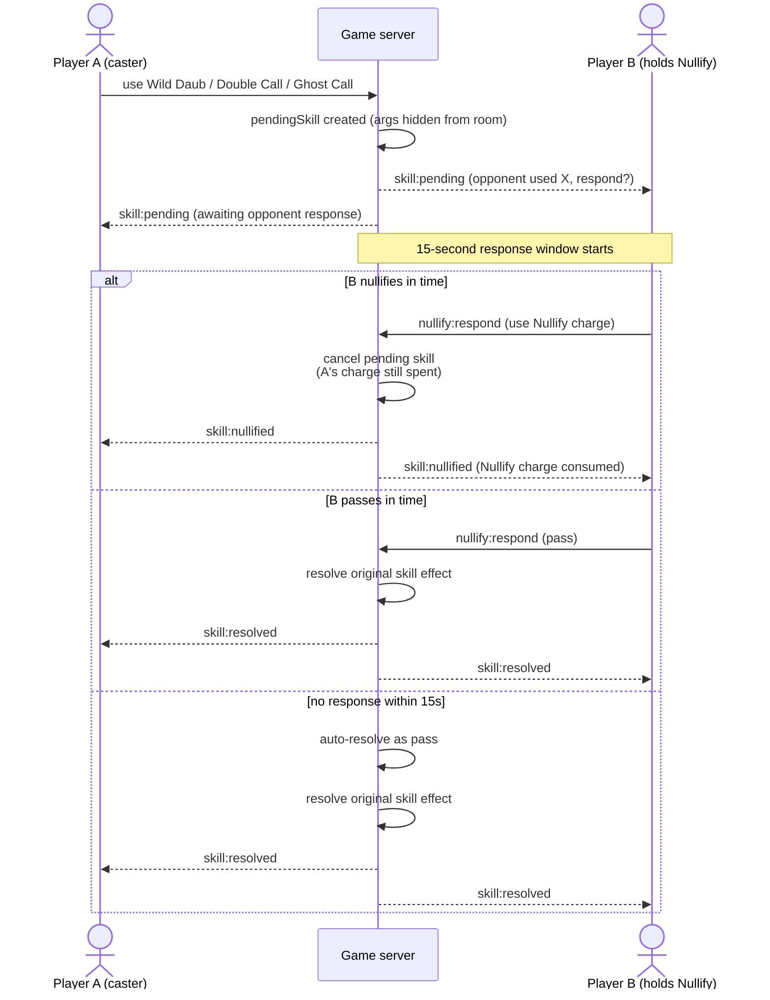

Skills are active ability cards used during a match, modeled after chess pieces rather than RPG stat boosts: you equip a small, fixed set of specific moves, not a growing pile of power.

## The 5 launch skills

<Note>
  Skill effects are executed entirely on the **game server**, never on-chain. On-chain, a skill is only an `effectType` identifier (e.g. `"WILD_DAUB"`); the server maps that identifier to real game logic. See [Architecture](/architecture).
</Note>

| # | Skill | `effectType` | Effect | Charge | Countered by |
|---|---|---|---|---|---|
| 1 | **Wild Daub** | `WILD_DAUB` | Mark one cell on your own board without that number being called | 1×/match | Nullify |
| 2 | **Double Call** | `DOUBLE_CALL` | Call 2 numbers instead of 1 on your turn | 1×/match | Nullify |
| 3 | **Ghost Call** | `GHOST_CALL` | The number you call this turn is only marked on your own board, not on opponents' boards | 1×/match | Nullify |
| 4 | **Cell Swap** | `CELL_SWAP` | Swap the numbers between 2 cells on your own board mid-match | 1×/match | None (resolves immediately) |
| 5 | **Nullify** | `NULLIFY` | Not used proactively; spent as a *response* to cancel one skill an opponent just used | 1×/match | timing |

Skins (a separate, purely cosmetic line: board themes, daub effects, avatar frames, victory animations) carry no gameplay effect at all.

<CardGroup cols={3}>
  <Card title="Wild Daub" img="https://thebingofi.vercel.app/assets/skills/wild-daub.png">
    Mark one cell on your own board without that number being called.

    Charge: 1×/match &middot; Countered by: Nullify
  </Card>
  <Card title="Double Call" img="https://thebingofi.vercel.app/assets/skills/double-call.png">
    Call 2 numbers instead of 1 on your turn.

    Charge: 1×/match &middot; Countered by: Nullify
  </Card>
  <Card title="Ghost Call" img="https://thebingofi.vercel.app/assets/skills/ghost-call.png">
    The number you call this turn is only marked on your own board, not on opponents' boards.

    Charge: 1×/match &middot; Countered by: Nullify
  </Card>
  <Card title="Cell Swap" img="https://thebingofi.vercel.app/assets/skills/cell-swap.png">
    Swap the numbers between 2 cells on your own board mid-match.

    Charge: 1×/match &middot; Countered by: None (resolves immediately)
  </Card>
  <Card title="Nullify" img="https://thebingofi.vercel.app/assets/skills/nullify.png">
    Not used proactively; spent as a *response* to cancel one skill an opponent just used.

    Charge: 1×/match &middot; Countered by: timing (must respond within the 15-second window)
  </Card>
</CardGroup>

## One skill per turn

A player can use at most one skill on their own turn, and only while it's their turn. Cell Swap resolves immediately; Wild Daub, Double Call, and Ghost Call each open a Nullify window (see below) before resolving, if an opponent is holding a Nullify charge.

## Nullify: the counterplay window

Whenever a player uses Wild Daub, Double Call, or Ghost Call, any opponent currently holding a Nullify charge gets a **15-second window** to respond:

- **Nullify**: spend their Nullify charge to cancel the skill entirely (the effect never happens; the original caster's charge is still spent regardless).
- **Pass**: let it resolve normally.
- **No response within 15 seconds**: the window auto-resolves as a pass, so an AFK or silent opponent can never stall a match indefinitely.

This is what keeps the skill layer closer to rock-paper-scissors than a raw power comparison: having a strong skill queued up doesn't guarantee it lands.

## Loadout: max 2, verified on-chain

Each player can equip **at most 2 skills** per match. Setting a loadout requires:

1. The room is in `standard` mode (loadouts don't exist in Casual rooms).
2. The player has linked a wallet (via a sign-a-nonce flow; no plaintext address is ever trusted).
3. The chosen skill IDs pass **on-chain verification**: the server checks actual NFT ownership (`SkillCollection.balanceOfBatch`), that the skill is marked `active` in the `SkillRegistry`, and that it respects that skill's `maxPerLoadout`, before the loadout is accepted.

Loadouts are frozen the moment the match starts (`playing` phase): no swapping skills mid-match. Players who don't set a loadout still play normally, without skills, same as a Casual room. **Free players remain fully competitive**, since Casual mode (no skills, no wallet required) is a complete, equal-footing way to play.

## Why it isn't pay-to-win

Two design choices keep this from becoming pay-to-win:

- **Effect strength is flat across rarity tiers.** A common copy of a skill and a rare copy of the *same* skill do exactly the same thing in a match. Rarity changes *flavor* (visual identity, animation, cosmetic flourishes), never raw power.
- **Hard caps everywhere.** Max 2 skills per loadout, typically 1 charge per skill per match, and a direct counter (Nullify) to every proactive skill. Owning more NFTs does not let a player stack more advantage into a single match than these caps allow.

### Premium identity per skill

Each skill is designed as its own character/mascot with dedicated visual assets: icon, card illustration, an in-match cast animation (an exploding daub, a spectral ghost-call, a spinning cell swap), and a frame/effect that gets more elaborate at higher rarity (static to animated to full effect). The NFT metadata structure reserves `image` and `animation_url` slots plus rarity attributes for exactly this purpose from day one, so visual assets can be dropped in later without touching the contracts or server (see the [`GET /metadata/:id.json`](/smart-contracts) response shape).
