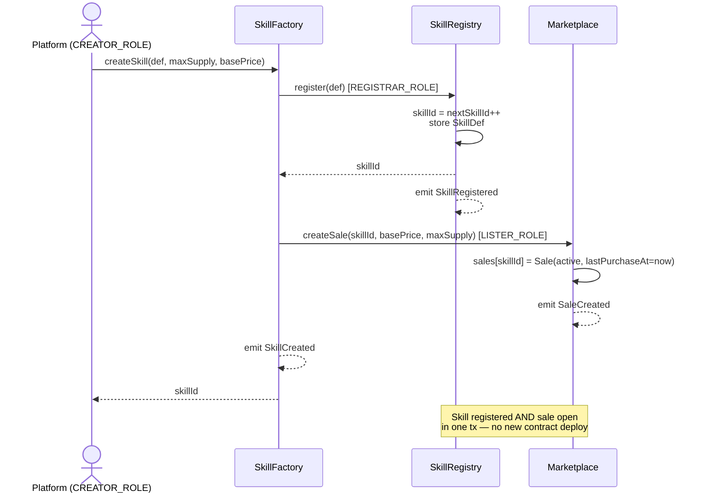
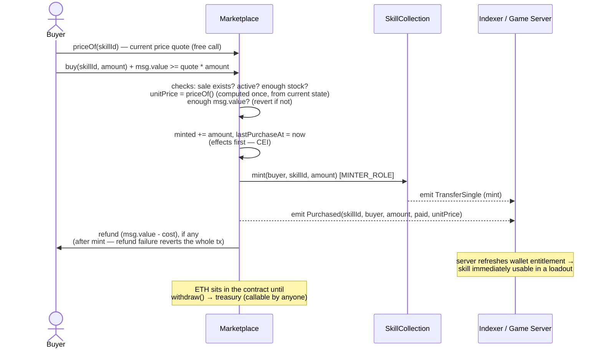

TheBingoFi's Solidity contracts (Foundry, Solidity ^0.8.24, OpenZeppelin) exist solely for **ownership and catalog** — there is no betting, pot, or stake mechanic anywhere in this code, only primary NFT sale plus standard secondary-market royalty support.

## The 4 contracts

| Contract | Role |
|---|---|
| **SkillRegistry** | The catalog of `SkillDef` records (`skillId`, `effectType`, `charges`, `cooldown`, `maxPerLoadout`, `rarity`, `active`, `metadataURI`). `effectType` (a `bytes32` identifier, e.g. `"WILD_DAUB"`) is **never executed on-chain** — it's mapped to real logic in the game server (see [Architecture](/architecture)). Only `REGISTRAR_ROLE` (held by `SkillFactory`) can call `register()`. |
| **SkillFactory** | The platform's single entry point (`CREATOR_ROLE`) for releasing a new skill: one call to `createSkill(SkillDef, maxSupply, price)` registers it in the Registry **and** opens its sale in the Marketplace. No new contract deployment per skill. |
| **SkillCollection** | One ERC-1155 contract for every Skill and Skin; `tokenId == skillId` from the Registry. Minting is restricted to `MINTER_ROLE` (held by the Marketplace). Implements **EIP-2981** with a default **5% (500 bps)** royalty. |
| **Marketplace** | Primary sale with **dynamic pricing** (see [Economy & Business Model](/economy)) — `buy(skillId, amount)` is payable, mints straight to the buyer, follows checks-effects-interactions, and auto-refunds overpayment. Revenue accumulates in the contract until `withdraw()` sends it to `treasury`. |

Role wiring (from `script/Deploy.s.sol`): `SkillFactory` holds `REGISTRAR_ROLE` on `SkillRegistry` and `LISTER_ROLE` on `Marketplace`; `Marketplace` holds `MINTER_ROLE` on `SkillCollection`.

## Live on GIWA Sepolia (chain ID 91342) — verified

<Info>
  All 4 contracts are deployed and **verified** on Blockscout. GIWA Sepolia is a testnet — there is no GIWA mainnet yet.
</Info>

| Contract | Address |
|---|---|
| SkillRegistry | [`0x453Ea80704A0d28c6a174c2eDACf49762813f308`](https://sepolia-explorer.giwa.io/address/0x453Ea80704A0d28c6a174c2eDACf49762813f308) |
| SkillFactory | [`0x1923eBbDd522c7FAd8BfCD8741372bff62109871`](https://sepolia-explorer.giwa.io/address/0x1923eBbDd522c7FAd8BfCD8741372bff62109871) |
| SkillCollection | [`0x58ABFFcA5C517f93B0116b5b1b1b6AF914148077`](https://sepolia-explorer.giwa.io/address/0x58ABFFcA5C517f93B0116b5b1b1b6AF914148077) |
| Marketplace | [`0xb3f468350c16906AA4E201CE4f7D464e0fb46D48`](https://sepolia-explorer.giwa.io/address/0xb3f468350c16906AA4E201CE4f7D464e0fb46D48) |

Machine-readable address list: `contracts/deployments/91342.json`. ABIs (plain ABI arrays, regenerated from source on every function/event change): `contracts/abi/*.json`.

The catalog is already seeded with the 5 launch skills (IDs 1–5) — see the supply/price table in [Economy & Business Model](/economy).

## Release flow: shipping a new skill (platform, 1 transaction)



## Purchase flow



## Functions the frontend calls

<Steps>
  <Step title="Quote the price — required before every purchase">
    `Marketplace.priceOf(skillId)` — a view function returning the **current** unit price, already including the scarcity premium and demand-decay discount. The frontend must always quote through `priceOf` — `basePrice` alone is stale the moment any unit sells or any time passes. See the pricing formulas in [Economy & Business Model](/economy).
  </Step>
  <Step title="Buy">
    `Marketplace.buy(skillId, amount)` — payable, `msg.value = priceOf(skillId) * amount` (quote immediately before submitting, to minimize drift from a moving price). Overpayment is automatically refunded in the same transaction; underpayment reverts with `InsufficientPayment(expected, actual)`.
  </Step>
  <Step title="Stock and base price">
    `Marketplace.sales(skillId)` → `(basePrice, maxSupply, minted, active, lastPurchaseAt)` — used for "X of Y left" stock display, rarity tier, and a discount badge (by comparing against `priceOf`). **Never** used to compute the actual purchase price.
  </Step>
  <Step title="Check ownership">
    `SkillCollection.balanceOfBatch(owners, skillIds)` — used by the server at matchmaking time to verify a loadout, and by the frontend for inventory/collection views (one call covers many IDs; single-item `balanceOf` isn't used).
  </Step>
  <Step title="Read the catalog">
    `SkillRegistry.nextSkillId()` then `getSkill(skillId)` for `1..n` — full `SkillDef` (charges/cooldown/maxPerLoadout/rarity) for rendering rules and the market.
  </Step>
</Steps>

### Deliberately not called by the app

- **`SkillCollection.uri(skillId)`** and `SkillDef.metadataURI` — name, description, and asset URLs are served by the game server's `GET /metadata/{id}.json` (built from on-chain `effectType`/`rarity`) instead. The **server, not on-chain `uri()`, is the source of truth for what the app displays** — though `uri()` remains available for third-party wallets/marketplaces that expect the standard ERC-1155 metadata path.
- **`SkillCollection.royaltyInfo(tokenId, salePrice)`** — read independently by third-party secondary marketplaces; the app has no reason to call it itself.
- **`Marketplace.pricingParams()`** — discount/hot-item badges are computed from the difference between `priceOf` and `basePrice`; the raw parameters aren't needed client-side.
- **All admin write functions** (`createSkill`, `setActive`, `createSale`, `setPricingParams`, `setTreasury`, `setURI`, `setDefaultRoyalty`, `mint`, role management) — operated by the platform via `forge script`/the explorer, never from the app UI.
- **`withdraw()`** — permissionless (funds can only ever flow to `treasury`), triggered manually to sweep revenue; there's no automated schedule for it yet.
- **Secondary transfers** (`setApprovalForAll`/`safeTransferFrom`) — a peer-to-peer marketplace UI isn't in scope yet (see [Roadmap & Status](/roadmap-status)).

## Events

<Warning>
  There is currently no indexer/event listener running against these contracts (see [Architecture](/architecture)) — the server verifies entitlements with live reads instead. This table documents what these events would back if an indexer is added later; it does not describe something already wired up.
</Warning>

| Event | Contract | Purpose |
|---|---|---|
| `SkillCreated(skillId, effectType, maxSupply, price)` | SkillFactory | A new skill was released — sync the catalog and map `effectType` to engine logic. |
| `SkillRegistered(skillId, effectType)` | SkillRegistry | Redundant with `SkillCreated`, useful if another registration path is ever added. |
| `SaleCreated(skillId, basePrice, maxSupply)` / `SaleActiveSet(skillId, active)` | Marketplace | Sale status for the storefront catalog. |
| `Purchased(skillId, buyer, amount, paid, unitPrice)` | Marketplace | The main indexer trigger — a purchase happened; `unitPrice` is the per-unit price at that transaction (for price history), `paid` is the net total actually charged (excluding refund). |
| `PricingParamsUpdated(scarcityBps, decayInterval, decayStepBps, maxDiscountBps)` | Marketplace | Admin retuned the global dynamic-pricing parameters. |
| `TransferSingle(operator, from, to, id, value)` / `TransferBatch(...)` | SkillCollection (ERC-1155 standard) | Mint/burn/transfer — the base for any future inventory/ownership indexer, including secondary-market transfers. |

## Testing

```bash
pnpm test:contracts   # forge test — 52/52 passing
forge coverage --no-match-coverage script   # 100% lines, statements, branches, and functions
```

Test coverage spans role guards (Registry), factory wiring, collection mint/royalty behavior, and the full Marketplace buy/sale lifecycle including dynamic pricing (scarcity ramp, demand decay, refunds, `setPricingParams` validation).
