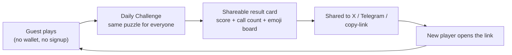

TheBingoFi is built for GASOK's Consumer/Social track, which means the social/growth loop is a first-class part of the product, not an add-on. This page separates what's **live in the server today** from what's still a **design idea**.

## Live today

### Daily Challenge: the viral hook

Every day, all players worldwide face the **same** solo puzzle: a deterministic number-calling sequence seeded from that day's date (so everyone gets an identical challenge, and the sequence is never exposed ahead of time; `GET /daily/today` returns only the challenge number and date, not the call order). You submit a board arrangement, the server simulates it against that day's sequence and stops the moment 5 lines are complete, then returns your score, how many calls it took, and a **shareable result card**, generated in both Indonesian and English, e.g. `"TheBingoFi #1 - 5 lines in 18 calls"` with an emoji grid of your board. Scores are automatically submitted to that day's leaderboard.

`GET /daily/leaderboard` returns the top 50 scores for a given date (one entry per nickname, best score only).

<Frame caption="The Daily Challenge screen: today's puzzle, your score, and the shareable result card.">
  
</Frame>

### Quests, including the VS Bot ladder

`GET /quests` returns the live quest catalog. It includes standard quests (win a match, use a specific skill, complete a diagonal line, etc.) and 5 seasonal **bot-ladder quests**, "Beat Bot Lv1/3/5/7/10", each completing automatically the moment you beat a bot at that level or higher (beating Lv5 completes the Lv1, Lv3, and Lv5 milestones in one match). `quest:completed` is pushed to a player's own socket the instant a quest finishes; `GET /quests/progress/:accountId` returns the same progress data over HTTP.

### Plaza: global chat and showcase

A **global** chat room (not scoped to any match room) where anyone connected, guest or wallet-linked, can post. Messages can optionally attach a `skillId` the sender wants to show off (rendered client-side as a skill card, not plain text): this is the "promote/show off your collection" mechanic from the original design. Server-side rules: nickname 1-24 characters, message text 1-280 characters, a rate limit of one message per 2 seconds per socket, and a 100-message rolling history buffer.

<Note>
  `skillId` attached to a Plaza message is **not** verified against actual on-chain ownership today; it's a display hint only. Ownership verification for this is planned alongside peer-to-peer marketplace features (see [Roadmap & Status](/roadmap-status)).
</Note>

<Frame caption="Plaza: the global chat and collection-showcase room.">
  
</Frame>

### Public shareable profiles

`/profile/<address>` shows a player's on-chain skill/skin collection (grouped by rarity tier) plus copy-link/X/Telegram share buttons, meant to work as a player's shareable "business card."

## Design ideas: not yet live

The following are part of the original social-layer design (`CONCEPT.md` §7) but are **not implemented** in the live server today:

<CardGroup cols={2}>
  <Card title="Friends & referral" icon="user-plus">
    Friend graph, invite links, and referral quests.
  </Card>
  <Card title="Club/Guild" icon="people-group">
    Club membership, club quests, and club leaderboards.
  </Card>
  <Card title="Spectator mode" icon="eye">
    Watching a friend's or tournament match live.
  </Card>
  <Card title="In-match emotes" icon="comment">
    Preset quick-chat/emotes during a match.
  </Card>
  <Card title="Weekend/monthly events" icon="calendar-star">
    Special win-condition modifiers, open tournament brackets, community goals.
  </Card>
  <Card title="Season Pass" icon="ticket">
    A free cosmetic progression track (with an optional cosmetic-only premium track).
  </Card>
  <Card title="Broader leaderboards" icon="ranking-star">
    Global / weekly / friends-only / club leaderboards. Only the **Daily Challenge** leaderboard exists today.
  </Card>
  <Card title="Peer-to-peer marketplace" icon="handshake">
    User-to-user escrowed secondary listings, distinct from the primary sale covered in [Economy & Business Model](/economy).
  </Card>
</CardGroup>

## Metrics this loop targets

The social features above are each aimed at a specific KPI the project tracks for its accelerator evaluation, not at engagement for its own sake:

- **DAU** and **D1/D7/D30 retention**: driven primarily by the Daily Challenge and quest reset cadence.
- **K-factor**: driven by the Daily Challenge share card and shareable public profile.
- **Matches per user per day.**
- **Guest to wallet-linked conversion rate.**

### The acquisition loop behind K-factor

Each loop through this cycle is one shot at K-factor greater than zero: an existing guest's result card is the only input, and a new guest landing on the app is the output. Nothing in the loop requires a wallet, so the acquisition funnel is not gated behind web3 friction.

<Note>
  These are the metrics the product is instrumented and designed to move. This documentation does not claim any specific measured value for them, since no user/traffic figures are part of the project's source-of-truth documents.
</Note>
